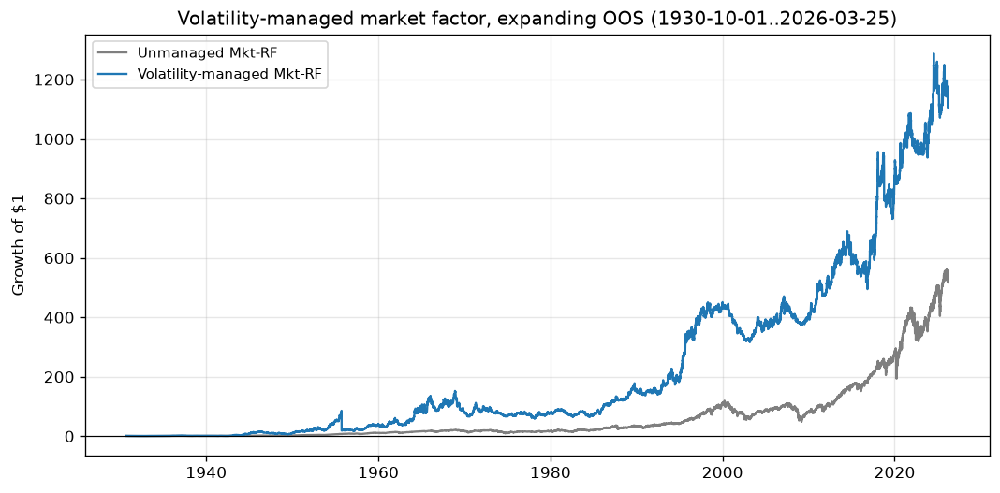
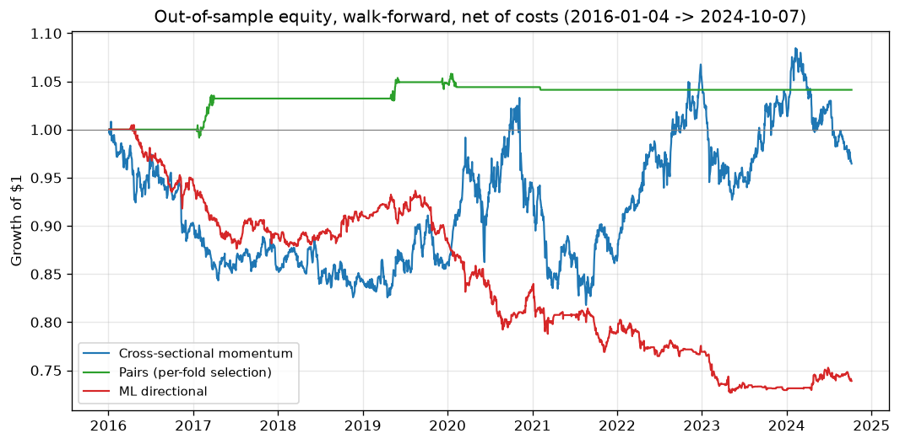
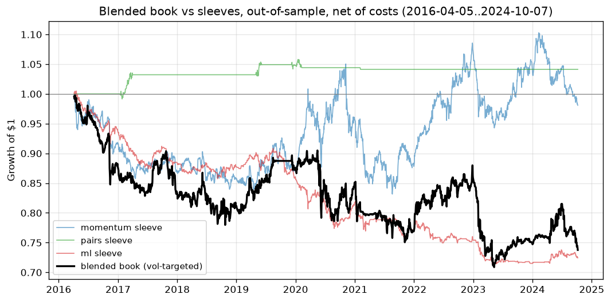
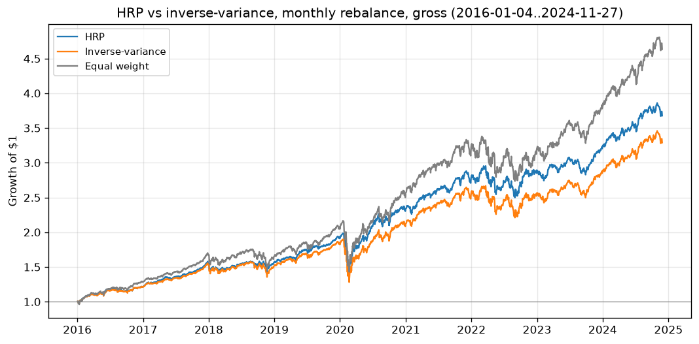
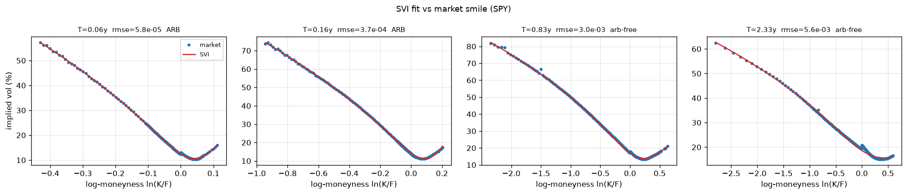
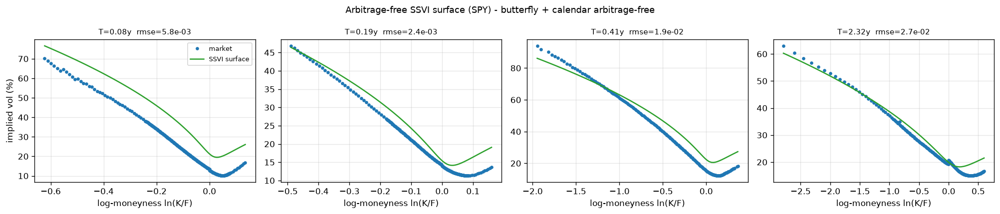
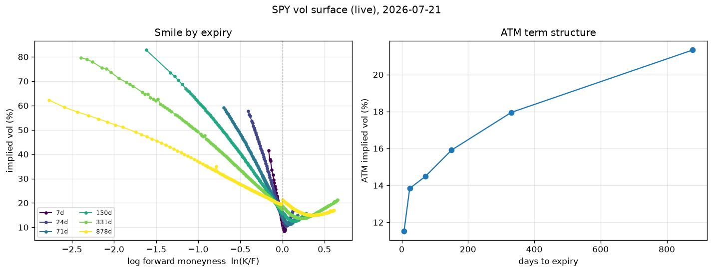
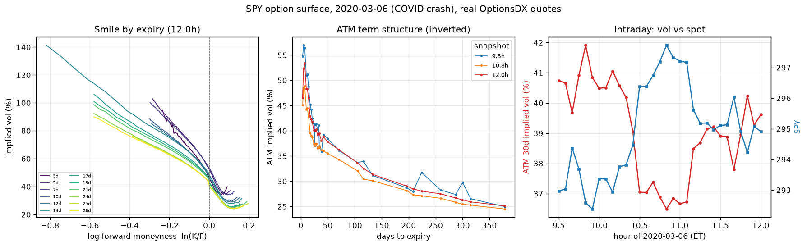
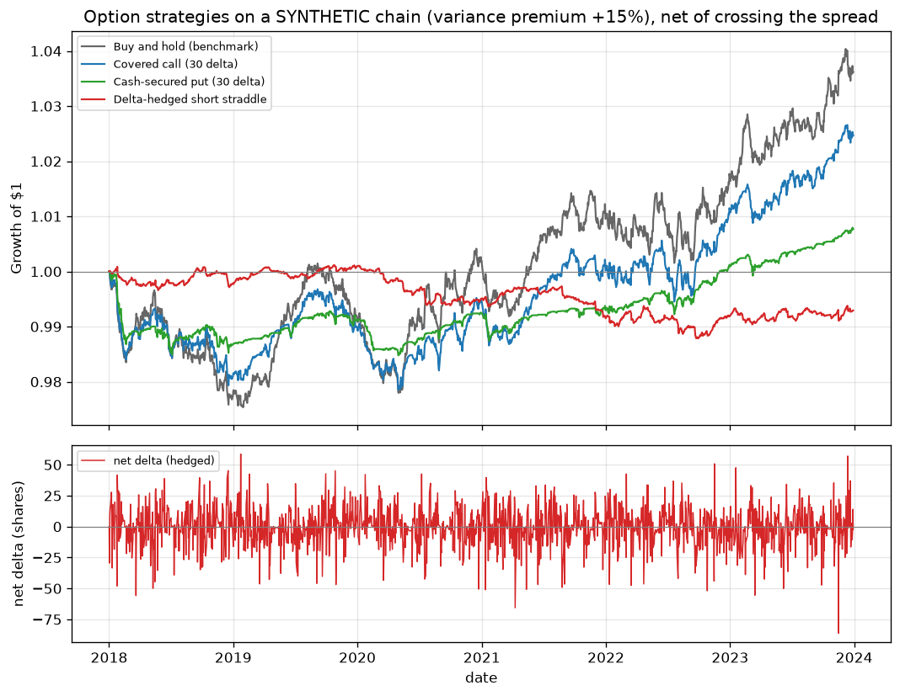

# quant-research-system

[](https://github.com/melihgiray/quant-research-system/actions/workflows/ci.yml)

A backtesting setup for systematic equity and single-stock options strategies on
daily data. It runs each strategy through an engine that charges realistic
trading costs, tests them out of sample, and prints the results. Nothing here
connects to a broker and nothing trades live. I built it to find out whether
these ideas survive once costs and proper out-of-sample testing get in the way,
and most of the interesting output is about how much of an edge the frictions
eat.

## Replication studies

The repository also contains small, separately documented replications of
published research. The first is Moreira and Muir (2017),
[*Volatility-Managed Portfolios*](https://doi.org/10.1111/jofi.12513). It scales
a factor by inverse trailing realised variance. The implementation uses daily
Ken French factor returns and an expanding out-of-sample design: realised
variance for a date ends the prior day, and the equal-volatility multiplier is
fitted inside each preceding training window. This differs deliberately from
the paper's full-sample descriptive normalization, which would leak later
information into an out-of-sample test. No paper-matching performance claim is
made here. Run
`python scripts/build_volatility_managed_results.py` to download the official
file and write the current metrics table and equity chart. The output is gross
of trading costs because the factor return is a research series, not an
executable instrument.

### Volatility-managed market factor

The current run uses daily Mkt-RF returns from the Ken French Data Library, a
five-year initial training window, one-year test windows, and a 21-trading-day
realised-variance estimate. It contains 99 expanding out-of-sample folds from
1930-10-01 to 2026-03-25. The scale multiplier is re-estimated only at each
fold boundary. Reproduce with `python scripts/build_volatility_managed_results.py`.

| Strategy | OOS Sharpe | Ann. return | Ann. vol | Max drawdown | Ann. exposure turnover |
|---|---:|---:|---:|---:|---:|
| Unmanaged Mkt-RF | 0.46 | 6.5% | 17.0% | -74.4% | n/a |
| Volatility-managed Mkt-RF | 0.47 | 7.3% | 20.1% | -79.7% | 31.0x |



This is not a clean win. The managed series gains a small amount of gross
return and Sharpe, but has higher realised volatility and a deeper maximum
drawdown. Its reported turnover is a factor-exposure proxy, not a tradable
implementation-cost estimate. The result therefore supports the narrow
historical comparison, not a claim of deployable alpha or paper-level
performance parity.

## Results

Walk-forward out-of-sample, real daily data (yfinance), 2016-01-04 to
2024-10-07, net of spread and square-root impact costs at $1M capital.
Reproduce with `python scripts/build_results.py`.

| Strategy | OOS Sharpe | Ann. return | Max drawdown | Turnover |
|---|---|---|---|---|
| Cross-sectional momentum (11 sector ETFs) | 0.00 | -0.4% | -20.8% | 7.6x |
| Pairs trade (per-fold selection) | 0.42 | +0.5% | -1.6% | 1.1x |
| ML directional (24 large caps) | -0.82 | -3.4% | -27.7% | 112.7x |



Reading these honestly: none of the three clears a significance bar after
costs, and the ML signal's edge is eaten alive by its own 112x turnover. That
is the finding, not a failure of the plumbing. The framework's job is to stop
a weak signal from looking strong, and two details in this table show it
working. First, sector momentum's Sharpe of 0.00 is what the real
Jegadeesh-Titman effect tends to look like on a small, recent, cost-charged
universe. Second, the pairs number used to be better: selecting the pair on
the full sample (which peeks at the test years) gave a 0.61 Sharpe, and
re-selecting the pair inside each walk-forward fold, which is the only thing
you could actually do in real time, deflates it to 0.42. The gap between those
two numbers is measured look-ahead bias.

### Combining the sleeves into one book

The three strategies trade different universes, so they can run together as one
book. Capital is split across them by inverse volatility, a risk-parity
weighting that gives each sleeve a similar risk budget, and the combined stream
is then scaled to a 10% annual volatility target. Both steps are causal: the
allocation for a day uses trailing sleeve volatility through the prior day, and
the vol-target scaler is lagged the same way. Each sleeve's returns already net
its own costs, so this is a fund-of-strategies over net streams, not a re-costed
super-book. Reproduce with `python scripts/build_blend_results.py`.

| Book | OOS Sharpe | Ann. return | Ann. vol | Max drawdown |
|---|---|---|---|---|
| Blended (inverse-vol, vol-targeted) | -0.33 | -3.5% | 9.5% | -29.0% |



Two honest readings. The volatility target works: realised vol lands at 9.5%
against the 10% aim. The allocation does not save the book, because equal-risk
weighting gives the negative-edge ML sleeve the same risk budget as the positive
pairs sleeve, so the blend inherits the drag and prints a -0.33 Sharpe. A naive
equal-weight blend scores -0.30 over the same span, so inverse-vol is not the
problem here; a sleeve that loses money out of sample is. Risk parity balances
risk, it does not decide which sleeves deserve capital, and skill-weighting the
sleeves is a separate piece of work.

A full one-file tearsheet for this book, with the headline metrics, a per-year
table, an equity-and-drawdown chart, and rolling Sharpe and rolling beta, is at
[docs/results/report.html](docs/results/report.html). It is self-contained (every
chart is an embedded image, no external assets) and rebuilt with
`python scripts/build_report.py`.

### Hierarchical risk parity vs inverse-variance

A separate allocation question: given a diversified universe, how should you
split capital across it. Inverse-variance weighting sizes each asset by 1/var
and ignores correlation, so a cluster of near-duplicate names quietly soaks up
risk budget. Hierarchical Risk Parity (Lopez de Prado, 2016) clusters the assets
on their correlation, reorders so similar names are adjacent, and splits the
risk budget down that tree, so a tight cluster is treated as one before its
members compete. No covariance matrix is inverted, which is what makes
mean-variance weights so fragile on noisy estimates.

Rolling monthly rebalance on the full 44-name universe, trailing-year
covariance, long-only, gross of trading costs (the question is allocation
quality, not execution). Reproduce with `python scripts/build_hrp_results.py`.

| Allocator | Sharpe | Ann. return | Ann. vol | Max drawdown | Effective N |
|---|---|---|---|---|---|
| HRP | 1.15 | +15.8% | 13.5% | -28.4% | 22.6 |
| HRP (Ledoit-Wolf) | 1.12 | +15.3% | 13.6% | -29.2% | 24.6 |
| Inverse-variance | 0.97 | +14.2% | 14.9% | -32.3% | 31.0 |
| Inverse-variance (Ledoit-Wolf) | 0.97 | +14.5% | 15.1% | -32.3% | 32.4 |
| Equal weight | 1.10 | +18.8% | 16.9% | -33.7% | 41.5 |



HRP does what the paper claims: the best risk-adjusted return, the lowest realised
volatility, and the shallowest drawdown. The counter-intuitive column is effective
N (one over the Herfindahl index of the weights): HRP holds fewer effective names
than inverse-variance, not more. It is more concentrated by name, yet realises
less risk, because it diversifies in risk space rather than trying to own a little
of everything. Equal weight earns the most raw return here by leaning into a
strong-equity decade, but pays for it in the highest volatility and the deepest
drawdown, which is the whole point of a risk-based allocator.

The Ledoit-Wolf rows are the honest test of a tempting upgrade: shrinking the
covariance toward a well-conditioned target barely moves either allocator (HRP
1.15 to 1.12, inverse-variance unchanged). That is the expected result once you
look at why. Shrinkage exists to tame the ill-conditioning that wrecks anything
which *inverts* the covariance, i.e. mean-variance optimisation. HRP never inverts
it (that is its whole selling point), and inverse-variance uses only the diagonal,
so there is little for shrinkage to fix. The near-zero effect is a feature, not a
disappointment: it shows these allocators already sidestep the problem shrinkage
is for. The chart plots the three headline books; the shrunk variants sit almost
exactly on top of them.

### Allocating across the sleeves: inverse-vol vs HRP vs ERC

The blended book above splits capital across the three sleeves by inverse
volatility. HRP clusters the sleeves and splits the risk budget down a tree; ERC
(equal risk contribution) solves for weights whose risk contributions are equal
under the full covariance. This runs all three (and naive equal weight) on the
same out-of-sample sleeve streams, each combined into one 10%-vol book, scored on
the same window. Reproduce with `python scripts/build_hrp_blend_results.py`.

| Sleeve allocation | OOS Sharpe | Ann. return | Ann. vol | Max drawdown |
|---|---|---|---|---|
| Inverse-vol blend | 0.23 | +1.1% | 5.6% | -9.1% |
| HRP blend | 0.28 | +0.9% | 3.4% | -6.6% |
| ERC blend | -0.13 | -1.3% | 7.9% | -26.3% |
| Equal-weight blend | -0.01 | -0.5% | 9.5% | -17.3% |

Two honest readings. First, inverse-vol and HRP beat naive equal weight, because
equal weight hands a third of the book each to the two losing sleeves (near-zero
momentum and negative-edge ML) while they starve them, concentrating into the
low-volatility pairs sleeve that actually made money. Second, and this is the
interesting one, ERC is the *worst* of the risk-based methods, below even equal
weight. That is not a bug: ERC works exactly as intended, its risk contributions
are equal to three decimals. The problem is what "equal risk contribution" means
here. To give each sleeve the same share of risk under correlation, ERC holds
pairs at 74% where inverse-variance holds it at 92%, and puts the freed capital
into the higher-volatility losing sleeves (18% in ML versus 6.6%). Equalising risk
is a diversification principle, not a skill principle, so when one sleeve is a
low-vol winner and the others lose, spreading risk evenly spreads capital toward
the losers. Risk parity balances risk; it does not know which bets deserve it.

### Meta-labeling the ML sleeve

Meta-labeling (Lopez de Prado) splits the ML sleeve in two: the directional
model still picks the side, but a second model grades that side (is this bet
likely right) and sets the size, vetoing the ones it is unsure about. The point
is precision, cutting false positives, not a new source of edge. Both legs below
run the same real-data walk-forward with the same regime sizing on the same data
pull, so the only difference is the meta layer. Reproduce with
`python scripts/build_meta_results.py`.

| ML sleeve | OOS Sharpe | Ann. return | Max drawdown | Turnover |
|---|---|---|---|---|
| ML primary | -0.70 | -2.9% | -24.4% | 113.4x |
| ML meta-labeled | -0.64 | -2.4% | -20.3% | 113x |

The honest reading: meta-labeling helps at the margin, a slightly better Sharpe
and a meaningfully shallower drawdown (it does veto some of the worst bets), but
it cannot rescue a signal whose underlying edge is negative after costs. A filter
on a losing signal is still a losing signal. The absolute numbers here differ a
little from the ML row in the top table because yfinance revises history between
pulls; what is comparable is the primary-versus-meta pair, which share one pull.

### Does forecasting volatility beat measuring it?

Two ways to decide when to turn risk down. The vol-ratio detector compares
trailing 21-day to 252-day realized volatility (backward-looking, slow). The
GARCH detector uses a one-step-ahead conditional-volatility forecast against its
own baseline (it reacts the day a shock lands). Both halve the sector-momentum
sleeve's risk on a defensive day. Reproduce with
`python scripts/build_regime_results.py`.

| Defensive sizing | OOS Sharpe | Ann. return | Ann. vol | Max drawdown |
|---|---|---|---|---|
| No regime | -0.02 | -0.7% | 10.3% | -22.8% |
| Vol-ratio regime | 0.00 | -0.4% | 9.3% | -20.8% |
| GARCH regime | -0.25 | -2.6% | 9.0% | -30.3% |

The honest reading: the fancier detector loses. GARCH sizing does deliver the
lowest average volatility, but it turns risk down at the wrong moments (fast
reactions whipsaw, cutting exposure just before rebounds), so it prints a worse
Sharpe and a deeper drawdown than doing nothing, while the slow realized-vol
detector edges out a small improvement. This is a narrow test, the base sleeve is
a near-zero-Sharpe signal to begin with, so these are overlays on weak returns
and the differences are small. But the direction is a useful antidote to the
assumption that a more sophisticated volatility model automatically sizes better.

## What's in it

Three strategies:

- **Cross-sectional momentum.** Rank the universe by its 12-month return skipping
  the most recent month, go long the top names and short the bottom, rebalance
  monthly. The last month gets skipped because short-term returns tend to reverse.
- **A pairs trade.** Find a cointegrated pair with the Engle-Granger test, trade
  the spread when it stretches past two standard deviations, and close it when it
  reverts. If the cointegration breaks down (p-value drifts above 0.10) it stops
  trading that pair. The pair is re-selected inside each walk-forward fold using
  only data available at the fold boundary, with a Benjamini-Hochberg correction
  across the candidates, so the choice of what to trade is as causal as the
  trading itself.
- **A machine-learning signal.** A gradient-boosted classifier predicts whether
  each name is up or down tomorrow from eight lagged features. The predicted
  probability sets the position size, so a confident call gets a bigger bet. SHAP
  values show which features it actually leans on, and the classifier can be
  scored with purged, embargoed cross-validation (`--cv`) so overlapping labels
  can't leak between the folds. Which features carry real signal is decided by a
  permutation-null p-value per feature, Benjamini-Hochberg corrected across the
  eight (`--feature-fdr`), so a feature that only looks significant because eight
  were tested gets demoted.
- **Fractional differentiation** for stationary-but-memory-preserving features
  (Lopez de Prado). First differencing a price makes it stationary but discards
  almost all of its memory; a fractional order finds the least differencing that
  passes an augmented Dickey-Fuller test. On a random walk that is about d = 0.3,
  which stays ~0.9 correlated with the level, where a full first difference keeps
  almost none of it. `min_ffd_order` searches for that order.
- **Triple-barrier labeling** (Lopez de Prado). Instead of "up in N days?", each
  position is labeled by which barrier its forward path touches first: a
  volatility-scaled profit target (+1), a stop (-1), or a holding-period limit
  (the sign of the return there). The label reflects what would actually have
  happened to the trade, path and all, not just the endpoint. A **CUSUM event
  filter** supplies the entries: rather than labeling every bar, it keeps only
  the ones where the cumulative move since the last event breaks a threshold, so
  the model trains on bars where something happened instead of on quiet noise.
- **Sequential bootstrap** (Lopez de Prado). Path-based labels overlap in time, so
  a plain bootstrap draws near-duplicates and overstates how much independent data
  there is. This draws samples one at a time, each pick weighted by how little it
  overlaps what has already been drawn (its average uniqueness), so the resampled
  set is closer to independent. On two identical labels plus a disjoint one it
  oversamples the disjoint one, as it should.

There is also a single-stock **options** leg: pricing and Greeks, a vol surface
built from live chains, and strategy backtests.

- Black-Scholes for European singles, and a Cox-Ross-Rubinstein binomial tree
  for American early exercise. The tree checks exercise-versus-hold at every
  node, so an American put is correctly worth more than its European twin,
  while an American call on a non-dividend payer collapses to the European
  price (which is a free correctness check on the whole tree, and a test).
- All five Greeks, closed-form where Black-Scholes provides one and central
  finite differences where it does not (American options have no analytic
  sensitivities). The two are asserted to agree across a grid of moneyness and
  expiry, which tests both paths at once.
- An implied-vol solver that says when it cannot answer. Deep in-the-money
  options are routed through their out-of-the-money twin by put-call parity,
  because nearly all of an ITM price is intrinsic and the volatility
  information sits in rounding error. Prices outside the static no-arbitrage
  band return NaN with a reason code rather than a fabricated number, which is
  what you want when a real chain hands you a crossed or stale quote.
- A **vol surface** in log-forward-moneyness and expiry, interpolated in total
  variance (`sigma^2 * T`) rather than in vol. That coordinate choice is the
  point: no-calendar-arbitrage is exactly "total variance rises with maturity",
  so interpolating there preserves it, while interpolating in implied vol can
  manufacture arbitrage from clean inputs.
- A parametric **SVI** fit as an alternative to interpolation: the five-parameter
  raw-SVI smile (implemented from the published Gatheral parameterization) is
  least-squares calibrated per expiry with its feasibility bounds, and each
  fitted slice is checked for butterfly arbitrage via Gatheral's g(k) density
  condition rather than assumed clean.



SVI fit against a live SPY chain (`python scripts/build_svi_fit.py`). The fit
tracks the market smiles to a fraction of a vol point, but the short-dated slices
are flagged as not arbitrage-free: they reproduce butterfly violations that are
already in the raw quotes (wide markets, stale prints), and g(k) catches it. The
longer-dated smiles fit cleanly and pass. The lesson is that a visually perfect
fit can still be arbitrageable, which is the whole reason to check rather than
assume. Passing `--arb-free` (or `fit_svi_points(..., arbitrage_free=True)`)
switches to a penalised fit that trades a little RMSE to keep g(k) positive, so
the short-dated slices come back arbitrage-free; it is a strong soft constraint,
not a certificate of positivity, and that distinction is stated in the code.
- For the certificate version there is **SSVI** (Gatheral and Jacquier's
  arbitrage-free surface parameterization): a three-parameter slice whose
  parameters carry sufficient conditions for no butterfly arbitrage, so a fit
  kept inside that region is provably clean rather than checked after the fact.
  SSVI is a sub-family of raw SVI, so it reuses the same evaluation, g(k) check
  and plotting. Fitting it to an arbitrageable smile yields a clean slice at a
  cost in fit error, because SSVI simply cannot represent the arbitrage.
- A full **arbitrage-free SSVI surface** fit ties the expiries together with one
  skew and one power-law curvature and fits an at-the-money variance per
  maturity. That term structure is built from non-negative increments, so it is
  non-decreasing by construction (no calendar arbitrage), while the per-slice
  butterfly conditions are enforced during the fit. The result is a surface that
  is provably free of both butterfly and calendar arbitrage, checked
  independently by `ssvi_surface_arbitrage_free` (the sufficient parameter
  conditions) and by `ssvi_surface_calendar_free` (the direct pointwise
  definition, total variance non-decreasing in maturity at every strike).



Fit against a live SPY chain (`python scripts/build_ssvi_surface.py`). Two honest
notes. First, the single arbitrage-free surface fits looser than the per-expiry
raw-SVI overlay above: that is the price of global consistency, one skew and one
curvature law cannot bend to each smile the way six independent slices can, and
it buys a surface with no arbitrage anywhere. Second, on this chain the sufficient
calendar condition reports False while the direct pointwise check reports True:
the surface is genuinely calendar-arbitrage-free, but the steep front-month
curvature sits right on the sufficient bound, a clean demonstration that those
conditions are sufficient and not necessary, which is why both checks exist.



Built from a live SPY chain with `python scripts/build_vol_surface.py`. Two
things in that picture are worth stating plainly, because they are what the
code had to survive:

**Most quotes in a real chain are not prices.** Of 2,310 raw SPY quotes, 399
were dropped: 219 with a zero bid (nobody is buying, so there is no market),
138 already expired, 42 with a spread too wide to mean anything. Each filter
reports its count rather than silently shrinking the dataset.

**The arbitrage checks find real violations, and most of them are boring.** On
that surface, 330 butterfly and 3 strike-monotonicity violations were flagged.
But surfaces are built from mid prices and you cannot trade at mid, so each
violation is graded against the bid-ask you would have to cross: only 61 of 330
exceed the local spread. The rest are mid-price artifacts, not opportunities.
The ones that do exceed it cluster in the 878-day LEAPS, where quotes go stale.
Flagging without that grading would be alarmism; smoothing them away silently
would be worse.

yfinance serves the current chain only, and a genuine multi-year EOD options
history needs a paid feed (OptionMetrics, ORATS, CBOE DataShop). The one thing
it is possible to get for free is a single-day snapshot, and there is a loader
for the OptionsDX end-of-day format that reads one. The sample used here is SPY
on 2020-03-06, the COVID crash Friday, in 31 intraday snapshots. That is not
enough to backtest a strategy, so strategy backtests still run on the labelled
SYNTHETIC chain. What one real, stressed day is good for is two things.

**Validating the solver against someone else's.** The file ships vendor implied
vols, so our Brent solver can be checked against an independent implementation
on ~9,000 real quotes per snapshot. Near the money the two agree to about 2
volatility points, and the gap is stable at 1.73 to 1.78 points across all 31
snapshots. The wings diverge more (tens of points on short-dated out-of-the-money
calls), which is expected: the vendor's rate, dividend and day-count assumptions
are unknown, and SPY options are American while we price European, so an
early-exercise premium sits in the in-the-money puts. We do not tune our solver
to close that gap. Our solver also declines on 148 quotes whose mid sits below
European intrinsic, where the vendor's model still prints a number, and that
disagreement is itself informative rather than a bug. Reproduce with
`python scripts/validate_optionsdx.py`.

**Seeing a crisis surface.** The same day, priced through the surface builder:



Put the term structure next to the calm 2026 live surface above and the
difference is the whole story. Calm: upward sloping, 7d at 11.5% rising to 21% a
year out. Crisis: **inverted**, 7d at 53% falling to 22% two years out, because
the market is pricing acute near-term uncertainty that it expects to subside.
The third panel tracks 30-day ATM vol against spot through the morning: they
move opposite each other, tick for tick, which is the leverage effect in real
time.

The OptionsDX file is not committed (its terms are not confirmed for
redistribution); the loader reads it from a path you provide, and a tiny
hand-built schema clone under `tests/fixtures/` covers the tests so the suite
needs no download.

### Repricing harness

`scripts/reprice_paper_book.py` pulls the current chain, rebuilds the surface,
fits the arbitrage-free SSVI surface, and runs a fail-loud health check
(`options/monitor.py`): it exits non-zero on an empty chain, an implied-vol
failure rate above a threshold, or arbitrage that exceeds the local bid-ask
spread, the violations that usually mean stale data rather than mid-price noise.
It writes a JSON run log and never trades.

The `paper-book` GitHub Actions workflow runs it and uploads that log as a build
artifact. Two deliberate choices about what it does *not* do: the daily schedule
is left commented out, so the job runs only when triggered by hand until someone
opts in, and the log is uploaded as an artifact rather than committed back to the
repo, so the job never writes automated commits into the history. Both are there
to keep a scheduled job from quietly changing the repo or spending Actions
minutes on its own.

### Option strategies

Covered calls, cash-secured puts, and a delta-hedged short straddle, run
through an event-driven engine that keeps the equity side's timing rule:
**orders decided at the close of day T fill against day T+1's quotes.** Fills
cross the spread (buy the ask, sell the bid), expiry settles physically so
assignment leaves you holding or short the stock, and position Greeks are
tracked daily.

Reproduce with `python scripts/build_options_results.py`.

| Strategy | Return | Ann. | Sharpe | Max DD | Trades | Spread paid |
|---|---|---|---|---|---|---|
| Buy and hold (benchmark) | +3.6% | +0.57% | 0.44 | -2.5% | 1 | $1 |
| Covered call (30 delta) | +2.5% | +0.39% | 0.39 | -2.1% | 158 | $446 |
| Cash-secured put (30 delta) | +0.8% | +0.12% | 0.26 | -1.5% | 157 | $404 |
| Delta-hedged short straddle | -0.7% | -0.11% | -0.34 | -1.3% | 1345 | $1,833 |



**These numbers are not evidence about markets.** The synthetic chain prices
implied volatility at 15% above trailing realised, so the variance risk premium
is an input, not a discovery. What the table shows is that the machinery
harvests that premium correctly and then tells you what it costs to collect.
The sweep makes the dependence explicit:

| Implied over realised | Straddle return |
|---|---|
| +0% | -3.25% |
| +15% | -0.71% |
| +30% | +1.85% |
| +50% | +5.31% |

Read that as the real finding: at these spread assumptions, **implied has to
exceed realised by roughly 20% before delta-hedged short volatility breaks
even.** Below that the frictions win. The straddle pays $1,833 of spread across
1,345 trades on $100k, which is why it trails a strategy that trades once. The
covered call underperforming buy-and-hold is also correct rather than broken:
capping your upside costs you exactly when the underlying rallies.

Around those:

- An engine that lags every signal by a day, so a position can never use a price
  it would not have had yet. The lag lives in one line, which makes it easy to
  check. There is a test that feeds the engine a deliberately cheating signal and
  confirms the lag strips its edge back to noise.
- Trading costs as a half-spread plus square-root market impact. Impact grows with
  how much you trade relative to daily volume, so the same strategy costs more at
  larger size. An optional participation cap (`--max-participation 0.05`) limits
  daily trading in a name to a fraction of its volume and carries the unfilled
  remainder to later days, the way a desk would actually work a large order.
- Walk-forward validation. The model refits on a rolling window and only the
  out-of-sample stretches get stitched into the final equity curve.
- The usual performance stats (Sharpe, Sortino, Calmar, drawdown, hit rate,
  turnover, VaR, CVaR), plus a Fama-French three-factor regression to see how much
  of the return is just market, size, and value exposure.
- A few honesty checks, because one number oversells. Probabilistic and Deflated
  Sharpe, bootstrap confidence intervals, a rough capacity estimate for how much
  capital the strategy could hold before costs eat it, and a Benjamini-Hochberg
  correction on the pairs scan so a pair picked from several candidates has to
  survive the fact that several were tried.
- Two side tools: a SEC EDGAR filing watcher that can text or call you when a
  company files paperwork to issue new shares, and a small script that asks Claude
  to turn a market snapshot into structured JSON.

## Running it

Needs Python 3.10 or newer.

```bash
python -m venv .venv && source .venv/bin/activate
pip install -r requirements.txt

# offline demo on generated data, no network needed
python -m quant_system.cli --synthetic

# real data from yfinance, cached locally after the first pull
python -m quant_system.cli --strategy all --universe all
```

Flags worth knowing: `--strategy {momentum,pairs,ml,all}`, `--synthetic`,
`--no-walk-forward`, `--bootstrap`, `--capacity`, `--shap`, `--next-open`,
`--rf 0.04`. `--next-open` fills signals at the next open instead of the
signal-day close, which drops the overnight gap you cannot actually trade on; it
needs open prices, so it works on synthetic or freshly fetched data (older caches
predate the open column). Run `pytest` for the test suite.

Every number this project claims about itself comes from one command:

```bash
./scripts/verify.sh      # test count + line coverage
```

At the current commit that is **172 tests passing, 67.8% line coverage**. The
uncovered part is mostly the CLI, the two network-dependent monitors, and
plotting code; the options pricing and surface modules run 90%+.

One note on data. yfinance rate-limits hard, and Yahoo hands back 429s if you pull
too much too fast. Prices get cached after the first good pull. If a pull fails,
the loader falls back to a generated dataset so the whole thing still runs end to
end. Anything from that fallback is labeled synthetic and is not real market data.

## A few design choices

The one-day lag. A signal formed at the close of day T is only allowed to earn day
T+1's return. The engine does this with a single `weights.shift(1)` rather than
scattering shifts through every signal, where one is easy to forget. Centralizing
it means there is exactly one place to get right and one place to test.

Square-root costs. Market impact grows with the square root of how much you trade
relative to daily volume, not linearly. Liquidity refills as you go, so the
marginal share is cheaper than the first. The practical consequence is that cost
depends on capital, which is what the capacity estimate uses.

The HMM is for looking, not sizing. The regime HMM decodes with Viterbi, which
reads the whole series including the future, so its labels are not safe to trade
on. Sizing runs off a causal volatility-ratio rule instead, and the HMM only feeds
the regime chart.

Synthetic data is honest about itself. The generated data has no real edge baked
in, so the strategies score near zero on it. That is the point. It exercises the
plumbing without pretending to be a result.

## Layout

```
quant_system/
  data/         loading, caching, the universe lists
  signals/      momentum, pairs, the ML signal
  risk/         sizing, drawdown and concentration limits, VaR/CVaR
  regime/       vol-ratio and HMM detection, regime-based sizing
  backtest/     the engine, cost model, walk-forward, capacity
  performance/  metrics, tearsheet, factor regression, significance, bootstrap
  monitor/      EDGAR watcher, Claude analyst
  cli.py        the entry point
tests/          unit tests
```

## Limitations

The factor proxies are ETFs (SPY, IWM, VTV, VUG), not the Ken French research
factors. Fine for a sanity check, swappable if I want the real thing. The
candidate-pair list itself is still hand-picked with hindsight (I chose pairs
known to move together), even though selection among them is now causal per
fold. Universe membership is today's list, so there is survivorship bias in the
single names. And none of this has traded a real dollar.

## License

MIT.
